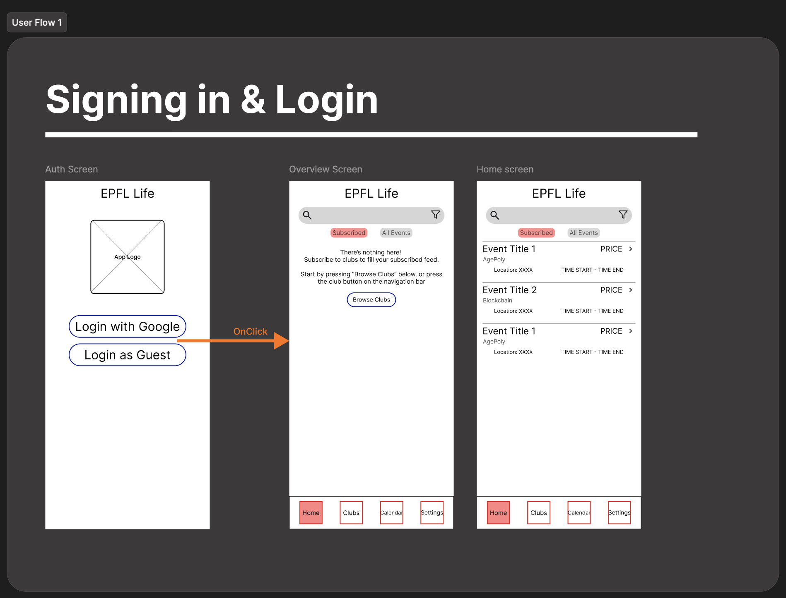
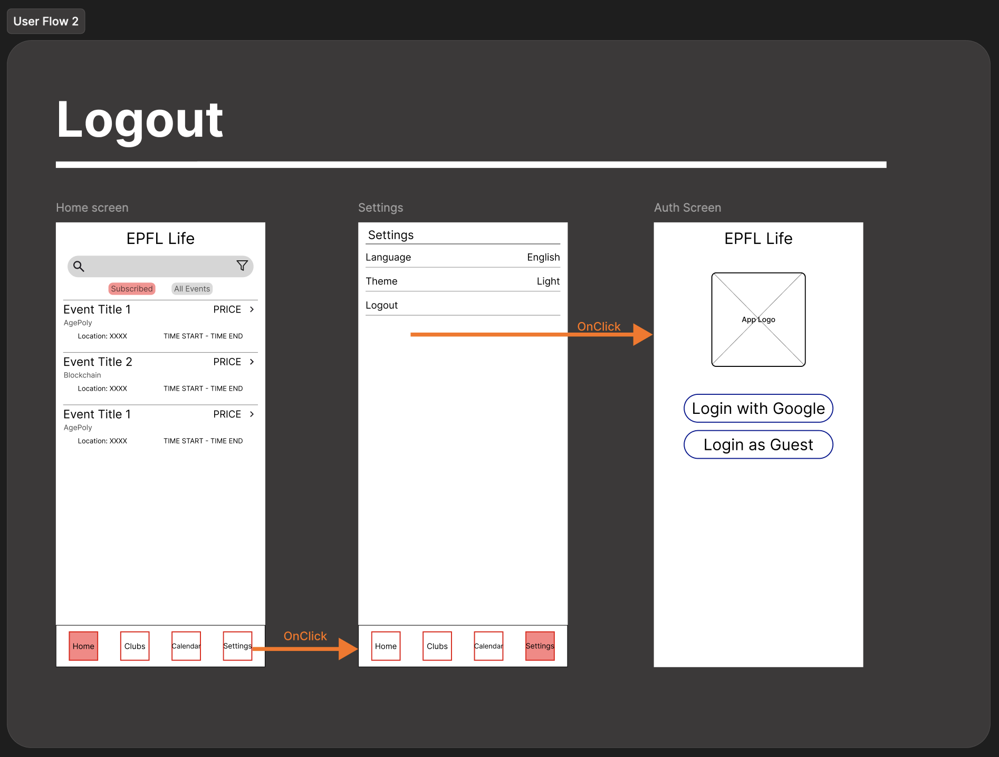
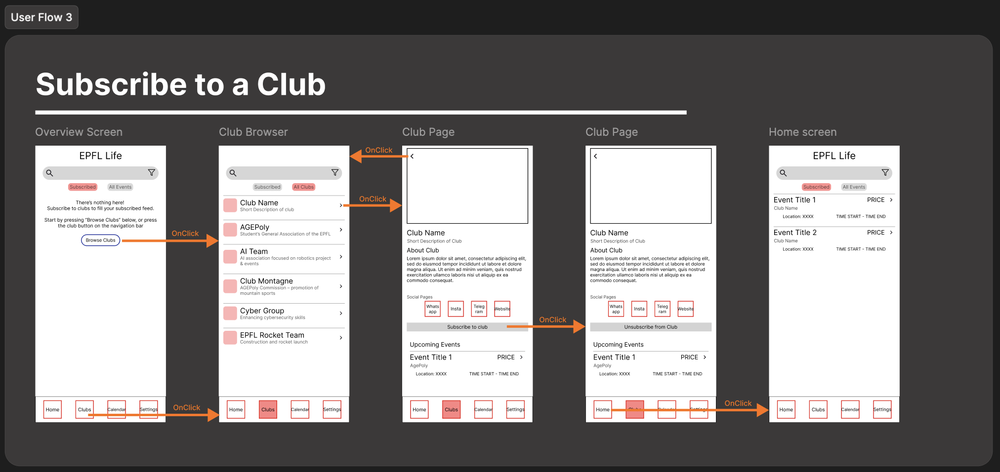
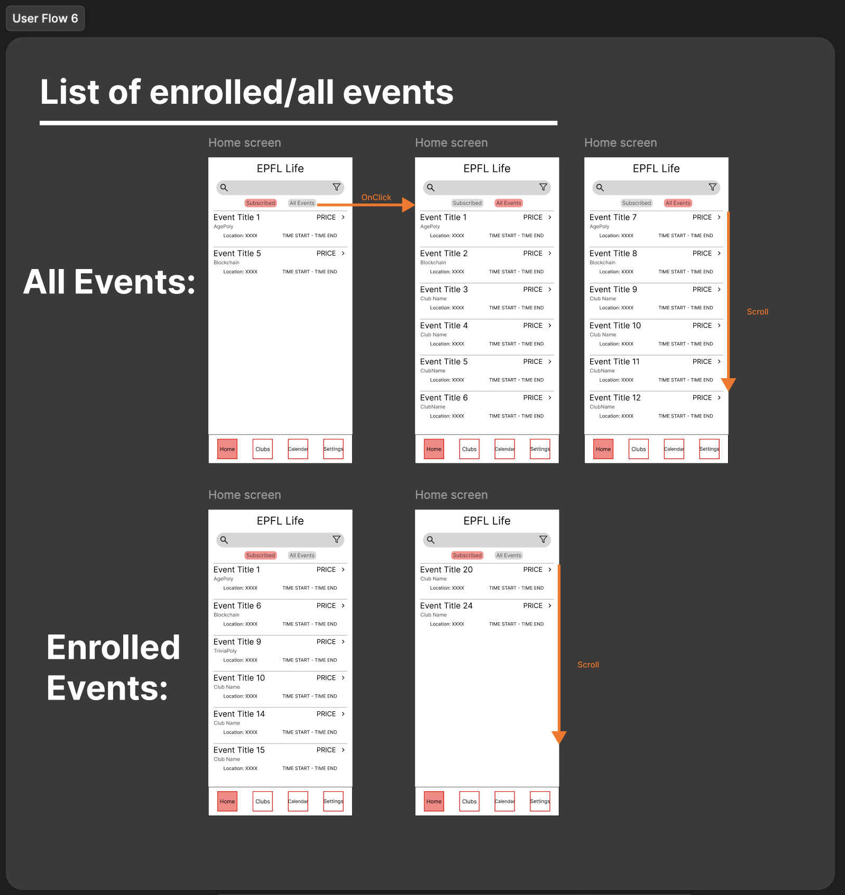

# EPFL LIFE

## Pitch

The app for EPFL student associations. The goal is to provide an easy way for students to find associations and stay up to date with events.
Associations can publish events and make announcements. Students have a simple overview of the events that are interesting to them. An integrated map view with the current GPS location will make it easy to find the events.

## Problem statement

The problem we are trying to solve is the mess that is event announcements. Associations like ESN, AgePoly, etc. publish messages via Outlook, Telegram, Instagram, WhatsApp, EPFL website or their individual website. This makes it very hard to stay up-to-date on what is happening on and around campus. By providing a unified way of sharing this information, we help both the associations and the students.

## Core features for associations

Associations can make announcements and publish events. Announcements are for informational purposes, while events have concrete dates and locations attached. Students are able to signal attendance, giving the event organizers more planning security.

## Core features for students

Students can log in via EPFL SSO and then see announcements and events in a feed. They can subscribe to associations to make sure they don't miss anything. With a map view, they are able to navigate from their current position to event locations.

## Extended features (stretch)

- Calendar of events
- Events nearby
- Live events (user-post with photo+location)
- digital membership cards
- Europe-wide login for guest students
- Ticket exchange (& payment?)
- See friend's attendance
- Automatic web/Telegram scraping

## Figma

https://www.figma.com/design/qNjleM72FjEUEppPUSS2Ok/EPFL-Life?node-id=0-1&t=auqmWM20TucyArQS-1

## References

This project uses the [Swent B3 Solution](https://github.com/swent-epfl/bootcamp-25-B3-Solution)
as the starting point.
## Figma Wireframes & User Flows

This section presents the current design progress for the **EPFL LIFE App** created in Figma.  
The goal of these designs is to define the **layout**, **navigation**, and **user experience** of the application before mockup development begins.

---

### Wireframes Overview

The following image shows all the wireframe screens created for the app.  
Each screen represents a different part of the user journey — from browsing clubs and viewing upcoming events, to subscribing and joining specific activities.

  

These wireframes establish:

- The Information architecture
- The High level layout
- The User interactions

---

### User Flows

The next set of images visualises the **user flows** between key pages in the app.  
Each diagram highlights how users move through the interface to complete a specific task.

   
   
   
   
   
   
   
  

This documentation serves as a proof of design progress and provides the basis for development and usability review.

---
