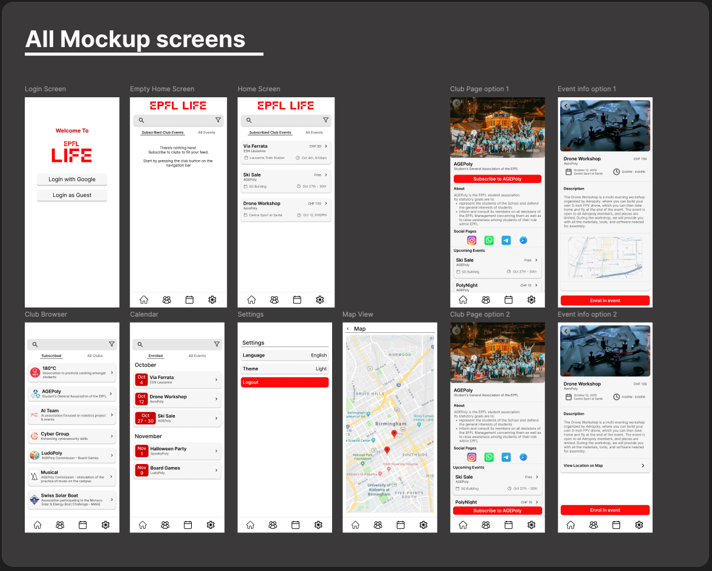
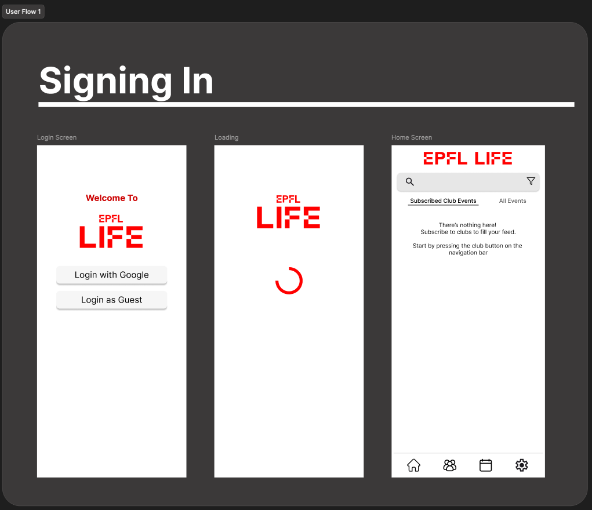
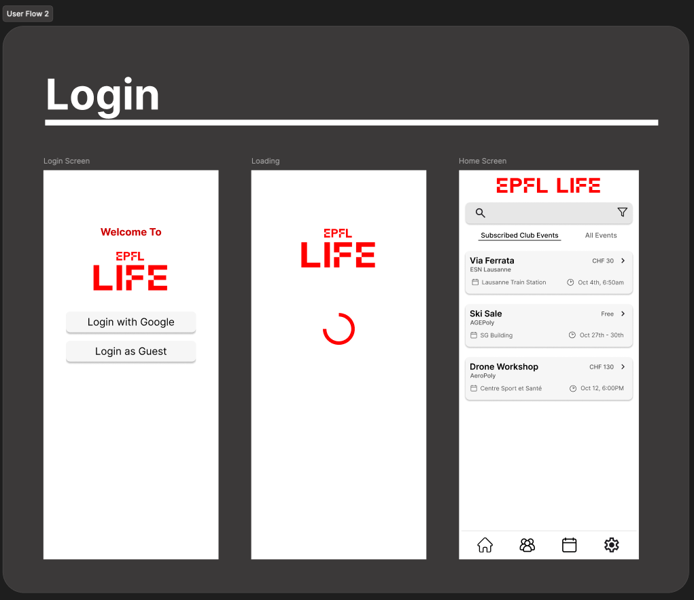
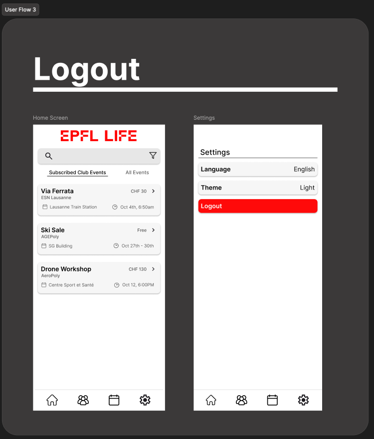
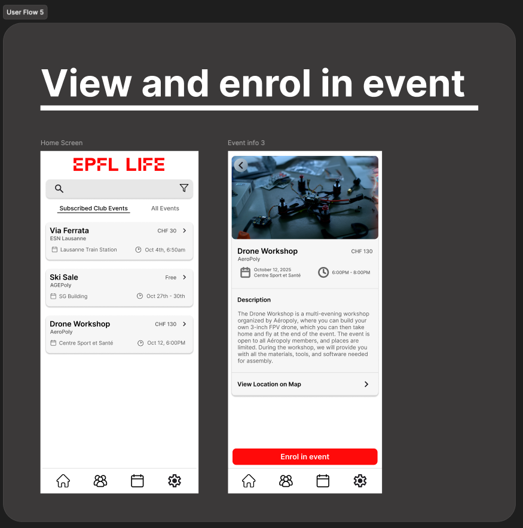
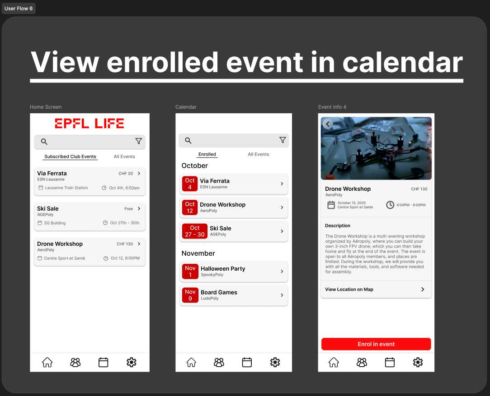
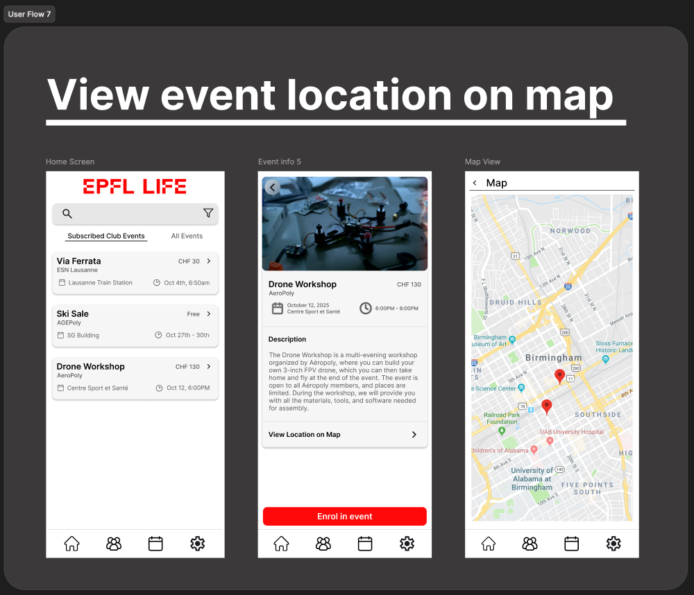

# Figma Design Documentation

This document presents the **wireframes**, **user flows**, and **mockup designs** created in Figma for the EPFL LIFE App.  
It serves as visual documentation for the app’s design phase and a reference for the team.

## Figma Wireframes & User Flows

This section presents the current design progress for the **EPFL LIFE App** created in Figma.  
The goal of these designs is to define the **layout**, **navigation**, and **user experience** of the application before mockup development begins.

### Wireframes Overview

The following image shows all the wireframe screens created for the app.  
Each screen represents a different part of the user journey — from browsing clubs and viewing upcoming events, to subscribing and joining specific activities.

  

These wireframes establish:

- The Information architecture
- The High level layout
- The User interactions

### User Flows

The next set of images visualises the **user flows** between key pages in the app.  
Each diagram highlights how users move through the interface to complete a specific task.

   
   
   
   
   
   
   
  

---

## Mockup Designs

The following section presents the **high-fidelity mockups** created in Figma for the EPFL LIFE app.  
These mockups represent the final look and feel of the interface before implementation, ensuring design consistency across all screens.

  

### User Flows

   
   
 
 
 
 

These mockups highlight:
- Final visual styling (colors, typography, and layout)
- Component spacing and hierarchy
- The consistent visual identity of the EPFL LIFE app

---

This documentation serves as a proof of design progress and provides the basis for development and usability review.

---